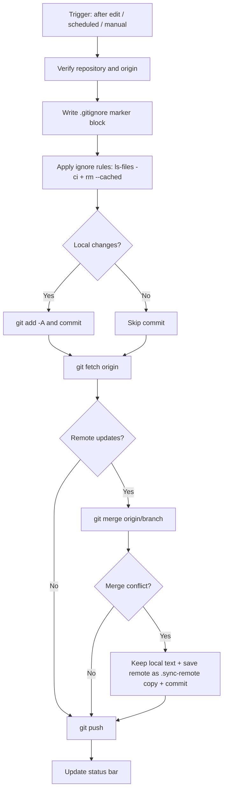

# Silence Git Sync

[](https://github.com/czhhbp/obsidian-silence-git-sync/releases)
[](LICENSE)

Sync your vault to a Git remote silently in the background. Edit your notes and forget about it — the plugin commits, merges, and pushes on its own. No popups, no interruptions; you only hear from it when something goes wrong.

> ⚠️ **Desktop only** (Windows / macOS / Linux). The mobile version of Obsidian runs in a sandboxed container where the system Git executable is unavailable, so this plugin disables syncing when loaded on mobile.

## Features

| Feature | Description |
| --- | --- |
| 🔗 One-field remote setup | Just paste an HTTPS URL. A missing `origin` is created automatically, and URL changes are applied for you. |
| 🤫 Silent background sync | Syncs automatically N minutes after you stop editing, plus a fixed-interval sync. Never shows a popup. |
| 🧠 Zero-loss conflicts | On conflict, your local text is kept as-is and the remote version is saved as `xxx.sync-remote.md`. Both sides get committed. |
| 🚫 Managed ignore paths | One path per line in settings, written into a marked block in `.gitignore`, and applied to already-tracked files immediately. |
| 🔐 Safe token injection | A Personal Access Token is injected into HTTP headers via a temporary `GIT_CONFIG_GLOBAL` file — never written to `.git/config`. |
| 📊 Status bar feedback | The status bar shows `Last sync: HH:MM:SS success/failure`. |
| ⌨️ Manual trigger | Left-ribbon icon, or the `Ctrl/Cmd + Shift + S` hotkey. |

## Installation

### Manual installation

1. Download `main.js`, `manifest.json`, and `styles.css` from [Releases](https://github.com/czhhbp/obsidian-silence-git-sync/releases).
2. Place them into `<your-vault>/.obsidian/plugins/silence-git-sync/`.
3. Enable **Silence Git Sync** under *Settings → Community plugins*.

### Requirements

- **Git** must be installed and the `git` command available on your `PATH` (on Windows, tick *Add Git to PATH* during installation).
- Your vault must either already be a Git repository, or you must provide a remote URL in the plugin settings.

To verify: run `git --version` in your vault root — it should print a version number.

## Settings

| Setting | Default | Description |
| --- | --- | --- |
| Remote HTTPS URL (optional) | empty | e.g. `https://github.com/user/repo.git`. Leave empty to reuse the vault's existing Git repository and `origin`. |
| Access token (optional) | empty | A GitHub/GitLab Personal Access Token (needs `repo` / `write_repository` scope). Leave empty to fall back to the system credential manager. |
| `.gitignore` | empty | One path per line. When empty, all dot-prefixed files and folders are ignored by default. |
| Sync delay after edit (minutes) | 5 | How long to wait after you stop editing before syncing. |
| Scheduled sync interval (minutes) | 30 | How often to run an additional sync. |

## How it works



**On the conflict strategy**: this plugin deliberately does **not** use silent overrides such as `-X ours`. When the same file has changed on both sides, it lets Git raise a real conflict, then:

1. Keeps the local version under the original filename (`git checkout --ours`).
2. Saves the remote version as `filename.sync-remote.ext`.
3. Commits both together.

This way **neither side's content is ever lost**, and you can compare and merge them by hand afterwards. Repeated syncs will not overwrite an existing copy.

## Differences from obsidian-git

| | Silence Git Sync | obsidian-git |
| --- | --- | --- |
| Sync strategy | `merge` | `merge` / `rebase` / `reset` |
| Conflict handling | Keeps both sides; remote saved as a copy | Marks conflicts for the user to resolve |
| Interface | Minimal settings, no extra views | Full source control view, history view, diff view |
| Goal | Frictionless background backup | A complete Git client experience |
| Mobile | Not supported (explicitly disabled) | Experimental (isomorphic-git, unstable) |

Do **not** enable both at once — they would operate on the same repository concurrently and can cause conflicts or index corruption.

## Development

```bash
git clone https://github.com/czhhbp/obsidian-silence-git-sync.git
cd obsidian-silence-git-sync
npm install

# Development mode (watch and rebuild)
npm run dev

# Production build (type check + minified main.js)
npm run build
```

### Releasing

The repository is wired up with GitHub Actions: pushing a tag builds and publishes a Release automatically, so no manual packaging is needed.

```bash
npm version patch        # 1. Bump the version (syncs manifest.json / versions.json)
git push origin main     # 2. Push the commit
git push origin --tags   # 3. Push the tag -> triggers build and release
```

After a tag is pushed, the workflow runs: install dependencies → type check and bundle → verify build artifacts → compare the tag with the `version` in `manifest.json` → create the Release and upload `main.js`, `manifest.json`, `styles.css`, plus a bundled `silence-git-sync.zip`.

> If the tag name (with an optional `v` prefix stripped) does not match the `version` in `manifest.json`, the workflow fails on purpose to prevent publishing artifacts for the wrong version.

| Workflow | Trigger | Purpose |
| --- | --- | --- |
| `.github/workflows/ci.yml` | push / PR to `main` | Verify the build on Node 18 and 20, upload artifacts |
| `.github/workflows/release.yml` | any tag push | Build, verify, then create the Release automatically |

### Project structure

```
silence-git-sync/
├── main.ts              # Entry point: lifecycle, timers, status bar, sync orchestration
├── src/
│   ├── constants.ts     # Message and marker constants
│   ├── git.ts           # git subprocess wrapper, platform detection, token injection
│   ├── sync-engine.ts   # Sync engine: repo checks, ignore rules, conflict preservation
│   ├── settings.ts      # Settings shape and defaults
│   └── settings-tab.ts  # Settings UI
├── esbuild.config.mjs   # Build script
├── manifest.json        # Plugin manifest
├── styles.css           # Status bar and settings panel styles
└── versions.json        # Version to minimum app version mapping
```

The top-level `.github/workflows/` directory holds the automated build and release definitions.

## License

[MIT](LICENSE)
