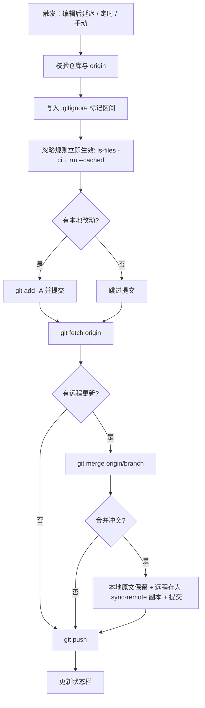

# Silence Git Sync

[](https://github.com/czhhbp/obsidian-silence-git-sync/releases)
[](LICENSE)

一个 Obsidian 插件：**用系统 Git 在后台静默同步笔记库**。改完笔记不用管，它自己提交、合并、推送；没有弹窗打扰，只在出错时告诉你。

> ⚠️ 仅支持**桌面端**（Windows / macOS / Linux）。Obsidian 移动版运行在无法调用系统 Git 的沙箱容器中，本插件在移动端加载后会静默禁用同步功能。

## 特性

| 特性 | 说明 |
| --- | --- |
| 🔗 一键关联仓库 | 在设置里填一个 HTTPS 地址即可，缺失的 `origin` 自动创建、地址变更自动更新 |
| 🤫 静默后台同步 | 停止编辑 N 分钟后自动同步，另有固定间隔定时同步，全程无弹窗 |
| 🧠 冲突零丢失 | 冲突时本地原文保留，远程内容另存为 `xxx.sync-remote.md`，两边都提交 |
| 🚫 忽略路径托管 | 设置里一行一个路径，自动写入库根 `.gitignore` 的标记区间，并让已跟踪文件立即生效 |
| 🔐 令牌安全注入 | Personal Access Token 通过临时 `GIT_CONFIG_GLOBAL` 注入 HTTP 头，不写入 `.git/config` |
| 📊 状态栏回显 | 状态栏显示 `上次同步：HH:MM:SS 成功/失败` |
| ⌨️ 手动触发 | 左侧功能区图标，或快捷键 `Ctrl/Cmd + Shift + S` |

## 安装

### 手动安装

1. 从 [Releases](https://github.com/czhhbp/obsidian-silence-git-sync/releases) 下载 `main.js`、`manifest.json`、`styles.css`。
2. 放入 `<你的库>/.obsidian/plugins/silence-git-sync/` 目录。
3. 在 Obsidian 的「设置 → 第三方插件」中启用 **Silence Git Sync**。

### 前置要求

- 系统已安装 **Git**，且 `git` 命令在 `PATH` 中可用（Windows 安装时勾选 *Add Git to PATH*）。
- 你的笔记库要么已是 Git 仓库，要么在插件设置里填入远程仓库地址。

验证方式：在库根目录执行 `git --version` 应能正常输出版本号。

## 配置说明

| 设置项 | 默认值 | 说明 |
| --- | --- | --- |
| 仓库 HTTPS 地址（可选） | 空 | 如 `https://github.com/user/repo.git`。留空则沿用笔记库已有的 Git 仓库与 `origin` |
| 访问令牌（可选） | 空 | GitHub/GitLab 的 Personal Access Token（需 `repo` / `write_repository` 权限）。留空回退到系统凭据管理器 |
| `.gitignore` | 空 | 一行一个路径。留空时默认忽略所有点号开头的文件和文件夹 |
| 编辑后同步延迟（分钟） | 5 | 停止编辑多久后自动同步 |
| 定时同步间隔（分钟） | 30 | 每隔多久额外同步一次 |

## 工作原理



**关于冲突策略**：本插件刻意**不**使用 `-X ours` 之类的静默覆盖。当同一个文件在两端被修改时，它会让 Git 产生真实冲突，然后：

1. 本地版本保留在原文件名（`git checkout --ours`）
2. 远程版本另存为 `文件名.sync-remote.扩展名`
3. 两者一起提交

这样**任何一端的内容都不会丢失**，你可以事后人工比对合并。多次重复同步也不会覆盖已生成的副本（`runGit add -A` 会带上新副本）。

## 与 obsidian-git 的区别

| | Silence Git Sync | obsidian-git |
| --- | --- | --- |
| 同步策略 | `merge` | 可选 `merge` / `rebase` / `reset` |
| 冲突处理 | 保留双方，远程另存副本 | 标记冲突交由用户处理 |
| 界面 | 极简设置项，无额外视图 | 完整的源代码管理视图、历史视图、diff 视图 |
| 目标 | 无感后台备份 | 完整的 Git 客户端体验 |
| 移动端 | 不支持（明确禁用） | 实验性支持（基于 isomorphic-git，不稳定） |

两者**不要同时启用**，否则会对同一个仓库并发操作，容易造成冲突或损坏索引。

## 开发

```bash
git clone https://github.com/czhhbp/obsidian-silence-git-sync.git
cd obsidian-silence-git-sync
npm install

# 开发模式（监听并自动重建）
npm run dev

# 生产构建（类型检查 + 压缩输出 main.js）
npm run build
```

发布新版本时同步三个文件里的版本号：

```bash
npm version patch   # 或 minor / major，会自动更新 manifest.json 与 versions.json
```

### 项目结构

```
silence-git-sync/
├── main.ts              # 插件入口：生命周期、定时器、状态栏、同步编排
├── src/
│   ├── constants.ts     # 提示文案与标记常量
│   ├── git.ts           # git 子进程封装、平台探测、令牌注入
│   ├── sync-engine.ts   # 同步引擎：仓库校验、忽略规则、冲突保留
│   ├── settings.ts      # 设置数据结构与默认值
│   └── settings-tab.ts  # 设置面板 UI
├── esbuild.config.mjs   # 构建脚本
├── manifest.json        # Obsidian 插件清单
├── styles.css           # 状态栏与设置面板样式
└── versions.json        # 版本与最低 Obsidian 版本映射
```

## 许可证

[MIT](LICENSE)
